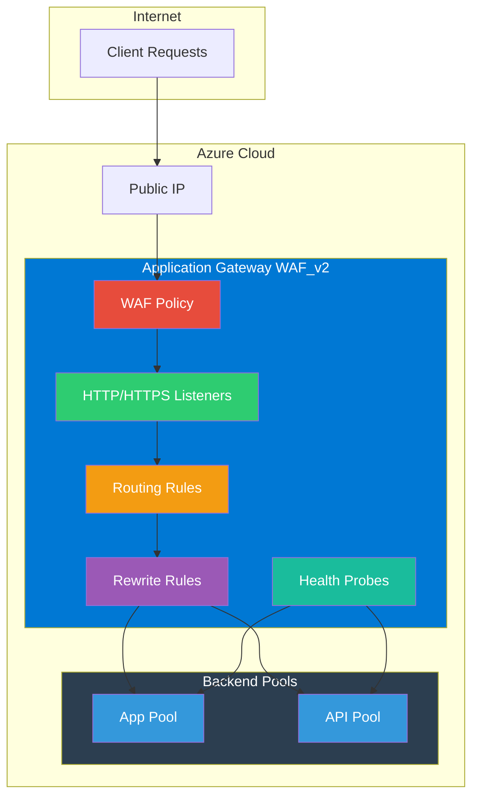

# Terraform Azure Application Gateway

Terraform module to deploy an Azure Application Gateway v2 with WAF, autoscaling, multi-site hosting, end-to-end TLS, and rewrite rules.

## Architecture



## Features

- Application Gateway v2 (Standard_v2 / WAF_v2) SKU
- Web Application Firewall with OWASP and Bot Manager rule sets
- Autoscaling with configurable min/max capacity
- Multi-site hosting with SNI support
- End-to-end TLS with trusted root certificates
- HTTP-to-HTTPS redirect configurations
- URL rewrite rules with conditions
- Custom health probes
- Availability zone deployment
- HTTP/2 support
- User-assigned managed identity for Key Vault integration

## Usage

```hcl
module "application_gateway" {
  source = "github.com/kogunlowo123/terraform-azure-application-gateway"

  name                = "appgw-prod"
  resource_group_name = "rg-networking"
  location            = "East US"
  subnet_id           = azurerm_subnet.appgw.id
  public_ip_id        = azurerm_public_ip.appgw.id

  backend_address_pools = {
    "web-pool" = {
      fqdns = ["web.example.com"]
    }
  }

  backend_http_settings = {
    "https" = {
      port     = 443
      protocol = "Https"
    }
  }

  http_listeners = {
    "https" = {
      frontend_port_name = "https"
      protocol           = "Https"
    }
  }

  request_routing_rules = {
    "main" = {
      priority                   = 100
      http_listener_name         = "https"
      backend_address_pool_name  = "web-pool"
      backend_http_settings_name = "https"
    }
  }
}
```

## Examples

- [Basic](./examples/basic/) - Simple HTTP Application Gateway with WAF
- [Complete](./examples/complete/) - Multi-site HTTPS with WAF, rewrite rules, and redirects

## Requirements

| Name      | Version   |
|-----------|-----------|
| terraform | >= 1.3.0  |
| azurerm   | >= 3.80.0 |

## Inputs

| Name | Description | Type | Default |
|------|-------------|------|---------|
| name | Name of the Application Gateway | string | - |
| resource_group_name | Name of the resource group | string | - |
| location | Azure region | string | - |
| subnet_id | Subnet ID for the gateway | string | - |
| public_ip_id | Public IP resource ID | string | - |
| sku_tier | SKU tier (Standard_v2 or WAF_v2) | string | WAF_v2 |
| waf_enabled | Enable WAF | bool | true |
| enable_autoscaling | Enable autoscaling | bool | true |
| backend_address_pools | Backend address pools | map(object) | - |
| backend_http_settings | Backend HTTP settings | map(object) | - |
| http_listeners | HTTP listeners | map(object) | - |
| request_routing_rules | Routing rules | map(object) | - |

## Outputs

| Name | Description |
|------|-------------|
| application_gateway_id | The ID of the Application Gateway |
| application_gateway_name | The name of the Application Gateway |
| waf_policy_id | The ID of the WAF policy |
| backend_address_pool_ids | Map of backend pool names to IDs |

## License

MIT Licensed. See [LICENSE](./LICENSE) for details.
